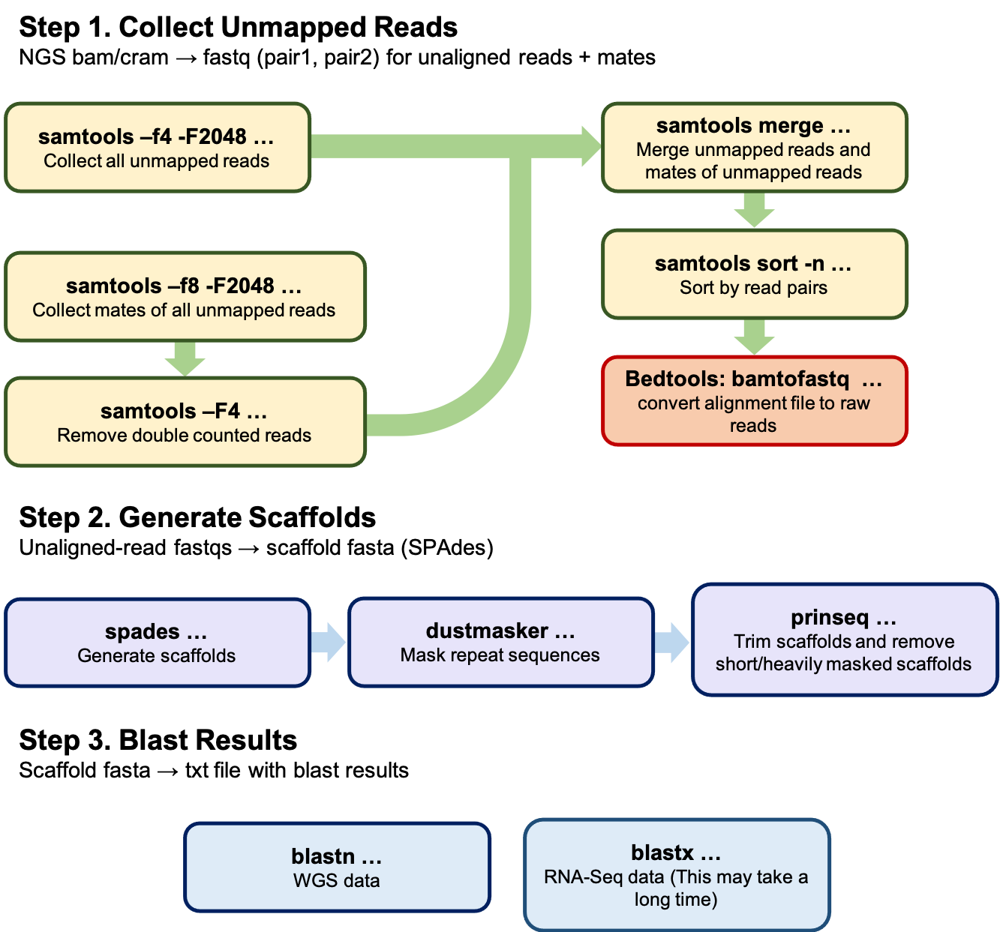

Analyze Unmapped Reads
======================

This script is used for the analysis of unmapped reads from next generation sequencing (NGS) data. 

Because this script uses scaffolds, it is *most* effective when the target DNA exists at a high enough depth to ensure sequence continuity. For example, it has been successfully used to identify:

 * Integrated HHV6 full sequences (~140kb) in 30x WGS data
 * Parvovirus B19 (5596bp) in samples with mean viral depth >1
 * *Rickettsia Rickettsii* (2.1Mb) fragments in a sample with mean viral depth <1

Overview
--------

Broadly, this script works in three steps:

 1. **Collect Unmapped Reads** *Samtools and Bedtools are used to extract all unmapped reads and their mates from bam/cram input*
 2. **Generate Scaffolds** *SPAdes is used to generate scaffolds from the unmapped reads*
 3. **Blast Scaffolds** *Blast is used to compare scaffolds to known sequences and identify likely sources of the 

Required Programs
-----------------

This script uses the following programs; alternate versions may also work:

  * [bedtools/2.27.1](https://github.com/arq5x/bedtools2)
  * [samtools/1.3.1](http://www.htslib.org/doc/1.3.1/samtools.html)
  * [blast/2.10.1+](https://ncbiinsights.ncbi.nlm.nih.gov/2019/12/18/blast-2-10-0/)
  * [spades](https://github.com/ablab/spades)
  * [dustmasker](https://www.ncbi.nlm.nih.gov/IEB/ToolBox/CPP_DOC/lxr/source/src/app/dustmasker)
  * [prinseq](http://prinseq.sourceforge.net)

Flags
-----

| Flag | Argument                  | Default                     | Description                                                  |
|------|---------------------------|-----------------------------|--------------------------------------------------------------|
| -b   | filename (required)       | -                           | BAM/CRAM input file                                          |
| -o   | string (required)         | -                           | the basename for the output file                             |
| -a   | integer (optional)        | 5                           | the number of blast alignments                               |
| -c   | integer (optional)        | 8                           | the number of threads to allow for parallel processing       |
| -d   | integer (optional)        | 20                          | dustmasker level                                             |
| -f   | no argument (optional)    | -                           | stop script after retreiving fastq files for unaligned reads |
| -k   | no argument (optional)    | -                           | keep unmapped fastq files                                    |
| -l   | blast db (optional)       | /n/shared_db/blastdb/202008 | full path to blast database                                  |
| -m   | integer (optional)        | 500                         | minimum scaffold length to keep                              |
| -n   | integer (optional)        | 10                          | max percentage of Ns in order to keep a scaffold             |
| -r   | no argument (optional)    | -                           | use RNA-Seq data                                             |
| -s   | no argument (optional)    | -                           | skip blast step                                              |
| -t   | temp directory (optional) | ./                          | a temporary directory to store intermediate files            |
| -h   | no argument (optional)    | -                           | print usage                                                  |

Example Usage
-------------

To use defaults, but keep unmapped read fastq output:

    `./analyze-unmapped-reads.sh -b sample1.cram -o sample1 -k`

To only return fastq files for unaligned reads:

    `./analyze-unmapped-reads.sh -b sample1.cram -o sample1 -f`

To use RNA-Seq data and limit scaffold lengths to 1kb or longer:

    `./analyze-unmapped-reads.sh -b sample1.cram -o sample1 -r -m 1000`

Output
------

| File           | Description                                         |
|----------------|-----------------------------------------------------|
| *fasta         | A fasta file of the final set of scaffolds          |
| *fastq.gz      | Paired fastq files for the samples' unaligned reads |
| *blast[nx].txt | a text file with blast results                      |

